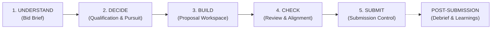

# Bid Intelligence — Decision & Proposal Platform

An endorsed **Enable My Growth** application developed by Feras Banna.

Bid Intelligence provides a decision-oriented environment for examining competitive tender opportunities, evaluating qualification gates, assembling proposals, auditing compliance, and controlling zero-defect submissions before committing resources. Human commercial judgment remains accountable at every stage.

---

## Core Mental Model

The platform is organized around the natural 5-stage human decision journey:

$$\text{UNDERSTAND} \longrightarrow \text{DECIDE} \longrightarrow \text{BUILD} \longrightarrow \text{CHECK} \longrightarrow \text{SUBMIT}$$



---

## Workflow Stages

| Stage | View | Core Questions Answered & Features |
|---|---|---|
| **1. UNDERSTAND** | `Bid Brief` | **What is this opportunity? What are they asking for? What must we deliver?**<br>Plain-language executive summary, scope streams, deliverables, qualification gates vs rated criteria, evaluation weighting, commercial terms, contract risks, submission rules, key dates, and source citations. |
| **2. DECIDE** | `Qualification & Pursuit Decision` | **Can we legitimately qualify? Should we bid?**<br>Hard-gate qualification matrix (`PASS`, `CONCERN`, `FAIL`, `UNKNOWN`), strategic clarification generator/tracker, multi-dimensional pursuit scoring, and accountable human override recording. |
| **3. BUILD** | `Proposal Workspace` | **What do we need to build?**<br>Proposal outline, integrated section drafter with criteria in-view, semantic content reuse from the Content Library, SOW deliverables register, working document registry, and action tasks. |
| **4. CHECK** | `Bid Review & Quality Gate` | **Are we compliant? Are we competitive? What could cause disqualification?**<br>Readiness scorecard, two-call proposal alignment analyzer (procurement stage classification & requirement coverage table), missing evidence scan, and full compliance matrix control sheet with PDF export. |
| **5. SUBMIT** | `Submission Control` | **Is the submission actually ready? What needs to be submitted and when?**<br>Final gate status (`READY TO SUBMIT` / `READY WITH WARNINGS` / `NOT READY — BLOCKERS EXIST`), deadline watch, dynamic RFP-derived package checklist, file verification, and formal submission release. |
| **DEBRIEF** | `Win / Loss Debrief` | *Contextually active post-submission.* Records official outcome, scores, competitor names, evaluator feedback, and institutional lessons learned. |

---

## Global Navigation

- **🏠 Dashboard:** High-level pipeline metrics, active pursuit cards, upcoming deadlines $\le 14\text{d}$, and win-rate KPI.
- **📋 Bids Directory:** Complete directory of all opportunities with stage filters, qualification status, and readiness gauges.
- **➕ New Bid Ingestion:** Upload RFP/tender document $\rightarrow$ Claude structured extraction $\rightarrow$ immediate synthesis of the Bid Brief and qualification gates.
- **📚 Content Library:** Central knowledge repository with Voyage AI semantic embeddings for methodologies, case studies, and past proposal blocks.
- **👥 Team & Resources:** Directory of key personnel, subject matter experts, and delivery resources with verified credentials and availability.
- **📊 Executive View:** Portfolio-wide risk analytics, win-rate trends, and executive PDF reporting.
- **⚙️ Firm Profile & Settings:** Configurable bidding firm profile (capabilities, credentials, standard insurance, and AI disclosure policy).

---

## Setup & Running

```bash
# 1. Install dependencies
pip install streamlit openpyxl reportlab supabase voyageai pypdf

# 2. Launch the application
streamlit run app.py
```

Opens at `http://localhost:8501`.

---

## Database Migrations

Database migrations are additive and backwards-compatible. To apply new tables and columns to Supabase:
1. Run `supabase_schema.sql` (initial schema)
2. Run `migrations/001_add_embeddings.sql` (semantic search)
3. Run `migrations/002_streamlined_workflow.sql` (Bid Briefs, Qualification Assessments, Bid Decisions, Firm Profiles)

---

## Brand Integration

See `BRAND-INTEGRATION.md` for product positioning, identity tokens, and the distinction between the Enable My Growth product brand and client-specific operating context.
