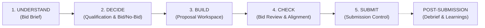

# BID INTELLIGENCE — TARGET ARCHITECTURE & SPECIFICATION

**Document Reference:** `docs/BID_INTELLIGENCE_TARGET_ARCHITECTURE.md`  
**Date:** September 2026  
**Product:** Bid Intelligence (Enable My Growth)  
**Status:** Approved Target Design

---

## 1. Architectural Philosophy & Core Mental Model

The redesigned Bid Intelligence platform inverts the traditional feature-centric software layout into a **decision-oriented cognitive journey**.

Instead of forcing users to navigate 12 isolated functional modules to piece together an understanding of an RFP, the software aligns with the natural five-stage lifecycle of competitive pursuit:



### Core Invariants:
1. **Decision Before Production:** Users evaluate qualification gates and pursuit viability before drafting proposal content.
2. **Contextual Intelligence:** AI functions (drafting, gap checking, clarification generation, risk scanning) operate where the user works, not in a separate "AI silo".
3. **Fact vs. Assessment vs. AI Interpretation:** The interface clearly distinguishes direct RFP quotes, internal bidder status/evidence, and AI-generated analytical commentary.
4. **Progressive Disclosure:** Executive summaries and top-level indicators are visible by default; detailed compliance registers and source citations expand on demand.
5. **Universal Genericization:** Multi-sector capability across consulting, technology, engineering, healthcare, and public sector tenders without client-specific hardcoding.

---

## 2. Navigation & Page Hierarchy

### A. Global Navigation (Sidebar Level 1)
- `🏠 Dashboard`: Pipeline health, active pursuit metrics, upcoming deadlines, urgent actions.
- `📋 Bids`: Comprehensive directory of all opportunities filtered by stage, client, value, and readiness.
- `➕ New Bid`: Streamlined ingestion workflow (Upload RFP $\rightarrow$ Claude Structured Extraction $\rightarrow$ Instant Bid Brief).
- `📚 Content Library`: Central repository of reusable methodologies, case studies, statements, and key personnel/expert profiles.
- `📊 Executive View`: High-level portfolio analytics, risk heatmaps, win-rate trends, and executive PDF reporting.
- `⚙️ Settings / Firm Profile`: Configurable bidding firm profile (name, capabilities, insurance, certifications, jurisdictions) powering generic AI prompts.

### B. Active-Bid Navigation (The 5 Workflow Stages)
When an active bid is selected, the sidebar collapses into a clear stage-based navigation structure:

```
Active Bid: [Client Name] — [Title]
Stage Badge: [In Progress / Qualifying / ...]
──────────────────────────────────────
1. 💡 UNDERSTAND    (Bid Brief)
2. ⚖️ DECIDE        (Qualification & Pursuit Decision)
3. 🛠️ BUILD         (Proposal Workspace)
4. 🔍 CHECK         (Bid Review & Compliance)
5. 🚀 SUBMIT        (Submission Control)
──────────────────────────────────────
[🏆 Debrief]        (Visible when Submitted / Closed)
← All Bids
```

---

## 3. Detailed Stage Specifications

---

### STAGE 1 — UNDERSTAND (`Bid Brief`)

**Purpose:** Transform dense RFP/tender documentation into instant executive intelligence, allowing the bid team to answer critical questions in under two minutes without opening the raw compliance matrix.

#### Key Sections:
1. **Opportunity Metadata Header:**
   - Buyer / Issuing Organization, Opportunity Title, Reference / File Number.
   - Submission Deadline & Clarification Deadline (with dynamic countdowns).
   - Estimated Contract Value, Procurement Model (Single contract, Framework / SOA, Panel, Call-off arrangement), Submission Channel / Portal.
2. **Executive Summary:** Plain-language, 2–3 sentence synthesis of what the buyer is actually trying to procure.
3. **What They Want (Scope):** Major solution and service streams categorized cleanly.
4. **Main Deliverables:** Concrete tangible outputs the contractor must produce (workshops, reports, systems, advisory sessions, audits, software).
5. **Conditions to Qualify (Hard Gates vs. Scored Criteria):**
   - *Mandatory Qualification Gates:* True pass/fail eligibility conditions (years of corporate experience, security clearances, mandatory certifications, geographic or language constraints, insurance coverage).
   - *Rated / Competitive Advantage:* Scored criteria and technical differentiators.
6. **How We Will Be Evaluated:** Multi-stage evaluation breakdown, technical vs. commercial weighting (e.g. 70% technical / 30% financial), presentation/interview gates, minimum threshold scores.
7. **Commercial Structure:** Contract duration, option years, call-off mechanics, volume guarantees (or lack thereof), pricing mechanism, travel reimbursement rules.
8. **Contract & Delivery Risks:** Critical clauses requiring early notice (IP ownership, data residency, AI use restrictions, indemnities, liability caps, unusual termination clauses).
9. **Submission Requirements Checklist:** Form names, mandatory separate financial envelope rules, signature requirements, file naming conventions, size limits.
10. **Key Dates Timeline:** Q&A deadline, addenda release period, proposal submission deadline, presentations, award date.
11. **Source Traceability & Progressive Disclosure:** Every intelligence section provides an expandable "View Source & Details" toggle displaying extracted verbatim RFP excerpts and section references.

---

### STAGE 2 — DECIDE (`Qualification & Pursuit Decision`)

**Purpose:** Rigorously evaluate feasibility, surface critical compliance blockers, formulate strategic clarification questions, and record an accountable GO / NO-GO decision.

#### Key Components:
1. **Hard-Gate Qualification Matrix:**
   - Tabular layout: `Requirement ID | Category | Description | RFP Reference | Qualification Status | Linked Firm Evidence | Gap / Action Required | Owner`.
   - **Strict Status Vocabulary:**
     - `PASS` (Green): Verified compliance backed by linked evidence.
     - `CONCERN` (Amber): Feasible but poses delivery, commercial, or scoring risk.
     - `FAIL` (Red): Blocker — bidder fails a mandatory criterion.
     - `UNKNOWN` (Grey): Unverified — requires active confirmation; cannot be assumed as PASS.
   - Hard-Gate Alert Strip: If any Mandatory requirement is set to `FAIL` or `UNKNOWN`, a persistent blocker alert prevents false confidence.
2. **Strategic Clarification Questions:**
   - Derives ambiguity questions dynamically from RFP text, mandatory criteria, and user-defined bidder concerns.
   - Classifies questions into: Critical (disqualification/pursuit risk), High (commercial/pricing risk), Medium (scope clarity).
   - Generates dual export formats:
     - *Client Submission Copy:* Neutral, professional question text referencing RFP sections (no internal strategy revealed).
     - *Internal Bid Team Copy:* Includes private strategic rationale and risk assessments.
3. **Bid / No-Bid Pursuit Decision Console:**
   - Multi-dimensional pursuit scoring (0–10 each): Strategic Fit, Capability Fit, Competitive Position, Resource Availability, Delivery & Contract Risk.
   - Recommendation: `GO`, `GO WITH CONDITIONS`, `NO-GO`, `NEEDS MORE INFORMATION`.
   - Win Themes, Hard Blockers, and Resolution Conditions.
   - **Accountable Human Override:** Bid leads can record the official decision, override AI recommendations, and log formal management justification notes.

---

### STAGE 3 — BUILD (`Proposal Workspace`)

**Purpose:** Consolidate all drafting, content reuse, deliverable detailing, document preparation, and team assignments into a unified working environment.

#### Key Sub-Views (Tabular / Contextual):
1. **Proposal Outline & Sections:**
   - Hierarchical section tree with section numbers, titles, assigned owners, word count targets, and status (`Not Started`, `In Progress`, `Draft`, `In Review`, `Complete`).
   - Visual progress bar showing outline completion.
2. **Contextual Section Drafter:**
   - Clicking any proposal section opens the integrated drafting panel.
   - *Criteria In View:* Automatically lists all RFP requirements mapped to this specific section.
   - *Semantic Content Reuse:* Automatically pulls the top semantically relevant content blocks from the Content Library based on the section title and requirements.
   - *AI Draft & Refine:* Generates and refines section prose directly aligned with the evaluation criteria.
   - *In-Place Editor:* Real-time editing, word count tracking, and version saving.
3. **Services & Deliverables Detail:**
   - SOW service breakdown, volume units, pricing structure (e.g. AI-assisted vs. standard rates), and optional add-on services.
4. **Working Document Registry:**
   - Upload and track draft proposal files, CVs, case studies, and partner declarations.
   - Version history and changelog tracking.
5. **Action Tasks Board:**
   - Tasks linked to qualification gaps, missing evidence, section drafting assignments, and clarification follow-ups.

---

### STAGE 4 — CHECK (`Bid Review & Alignment`)

**Purpose:** Comprehensive quality gate answering: *Are we compliant? Are we competitive? Are we complete? What could cause disqualification?*

#### Key Components:
1. **Submission Readiness Scorecard:**
   - Overall Readiness Index (0–100%).
   - Metrics summary: Hard Blockers, High Warnings, Unresolved Mandatory Requirements, Missing Submission Documents, Weak Proposal Sections.
2. **Proposal Review & Tender Alignment Analyzer:**
   - Upload full draft/final proposal (PDF/Word/Text).
   - Dual-call AI evaluation engine:
     - *Call 1:* Evaluates proposal alignment against all tender documents in the registry (RFP, addenda, bulletins, Q&As). Classifies findings into procurement stages:
       - *Proposal Submission:* Items required with the proposal.
       - *Negotiation / Shortlist:* Items required only if shortlisted.
       - *Contract Execution:* Pre-signing conditions (e.g. final insurance certificates, bonding).
       - *Contractual Obligation:* Post-award performance duties.
     - *Call 2:* Per-requirement coverage matrix scoring each criterion as `Fully Addressed`, `Partially Addressed`, `Not Addressed`, or `Cannot Assess`.
   - Generates an executive PDF report for management sign-off.
3. **Compliance Matrix Control View:**
   - Detailed interactive table of all requirements for deep-dive editing, owner re-assignment, and client-facing PDF compliance matrix export.
4. **Clarification Status Audit:**
   - Verifies whether all submitted clarification questions received answers, and flags any responses that necessitate compliance matrix updates.

---

### STAGE 5 — SUBMIT (`Submission Control`)

**Purpose:** Final gatekeeper ensuring zero-defect package assembly and timely delivery through the specified procurement portal.

#### Key Components:
1. **Final Gate Status:**
   - Prominent indicator: `READY TO SUBMIT` (Green), `READY WITH WARNINGS` (Amber), or `NOT READY — BLOCKERS EXIST` (Red).
2. **Submission Metadata & Deadline Watch:**
   - Official submission deadline with real-time countdown.
   - Submission channel / URL / email address.
   - Financial separation rules (separate envelope/file verification).
3. **Dynamic RFP-Derived Submission Checklist:**
   - Automatically generated from extracted submission requirements and documents.
   - Tracks document existence, approval status, file size compliance (e.g., $\le 20\text{ MB}$), and authorized signatures.
4. **Final Gate Verification Checklist:**
   - Mandatory requirements complete check.
   - Pricing consistency check.
   - Addenda acknowledgment check.
5. **Mark as Submitted Action:**
   - Formally transitions the bid stage to `Submitted`.
   - Automatically unlocks the post-submission **Debrief** module.

---

### POST-SUBMISSION — DEBRIEF (`Win / Loss Learning`)

**Purpose:** Contextually capture procurement outcomes and evaluator feedback to build institutional bidding intelligence.

#### Features:
- Automatically enabled once a bid is marked as `Submitted`, `Won`, `Lost`, or `Withdrawn`.
- Records: Official outcome, technical score, financial score, overall rank, competitor names, evaluator feedback, win factors, loss factors, and lessons learned.
- Feeds win-rate analytics in the Executive View.

---

## 4. Genericization & Firm Profile System

To eliminate all hardcoded company names, credentials, and domain assumptions:
1. **Firm Profile Entity (`firm_profile`):**
   - Company Name, Trading Name, Primary Markets / Jurisdictions.
   - Standard Overview & Value Proposition.
   - Core Capabilities, Key Sectors, Languages.
   - Certifications, Security Clearances, Standard Insurance Limits.
   - AI Usage Disclosure Policy.
2. **Prompt Injection:** All AI prompts in `analyst.py`, `extractor.py`, and drafting services ingest the active `Firm Profile` dynamically.

---
